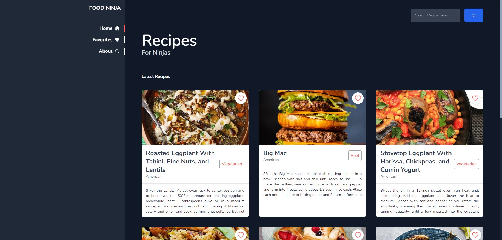
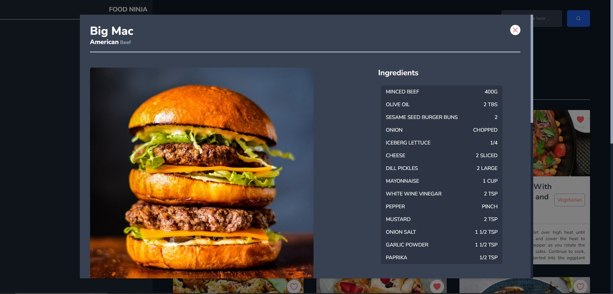
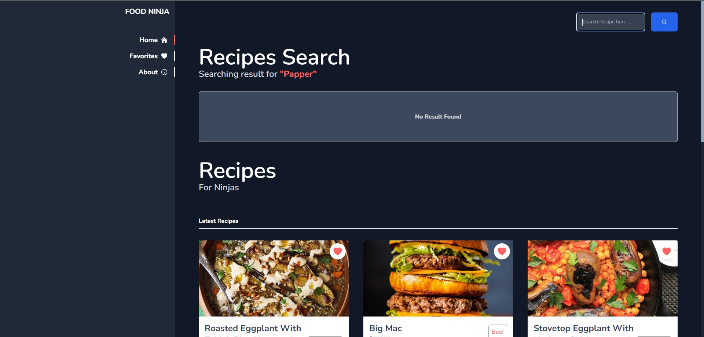
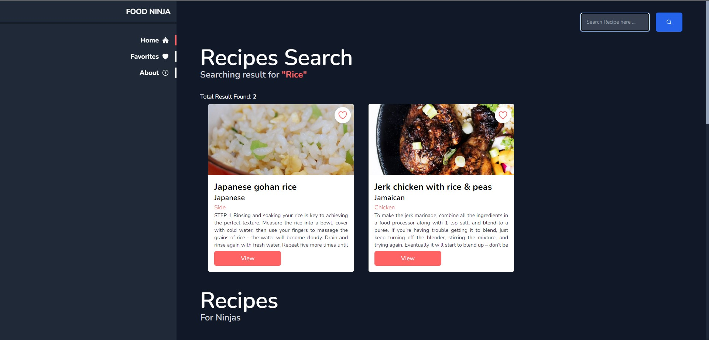
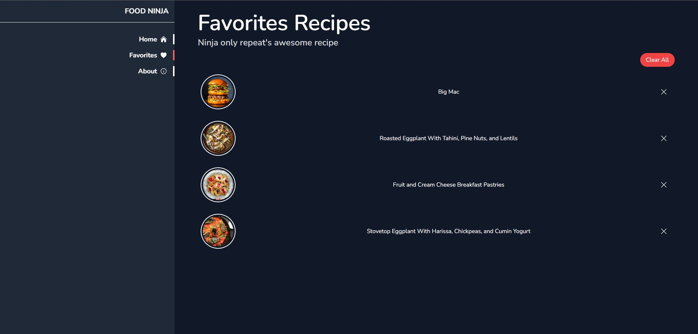
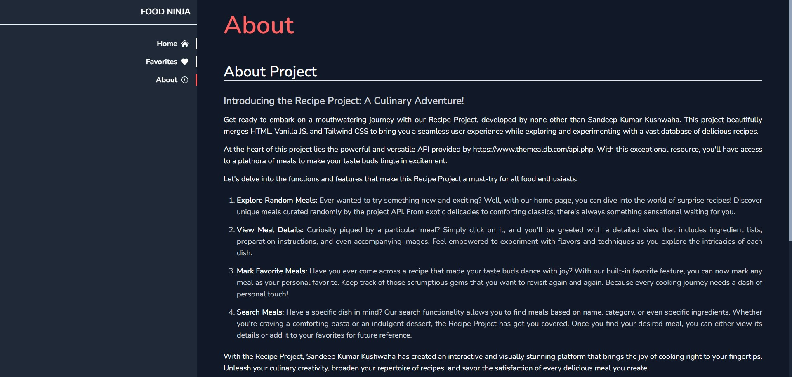
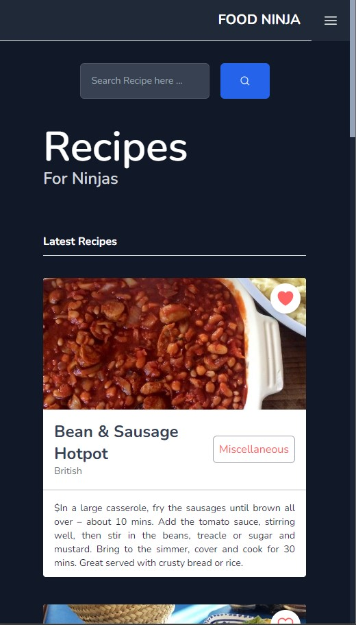
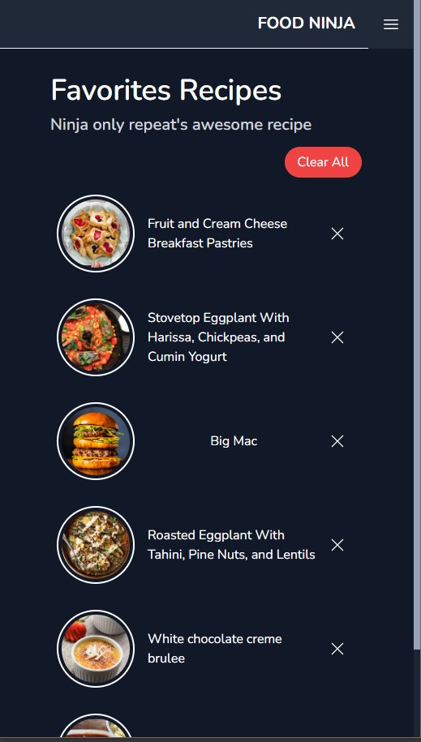

# Food Ninja 

## Introducing the Recipe Project: A Culinary Adventure!

Get ready to embark on a mouthwatering journey with our Recipe Project, developed by none other than Sandeep Kumar Kushwaha. This project beautifully merges **HTML**, **Vanilla JS**, and **Tailwind CSS** to bring you a seamless user experience while exploring and experimenting with a vast database of delicious recipes.

At the heart of this project lies the powerful and versatile API provided by **[The MealDB APIs](https://www.themealdb.com/api.php)**. With this exceptional resource, you'll have access to a plethora of meals to make your taste buds tingle in excitement.

Let's delve into the functions and features that make this Recipe Project a must-try for all food enthusiasts:

1. **Explore Random Meals:** Ever wanted to try something new and exciting? Well, with our home page, you can dive into the world of surprise recipes! Discover unique meals curated randomly by the project API. From exotic delicacies to comforting classics, there's always something sensational waiting for you.
2. **View Meal Details:** Curiosity piqued by a particular meal? Simply click on it, and you'll be greeted with a detailed view that includes ingredient lists, preparation instructions, and even accompanying images. Feel empowered to experiment with flavors and techniques as you explore the intricacies of each dish.
3. **Mark Favorite Meals:** Have you ever come across a recipe that made your taste buds dance with joy? With our built-in favorite feature, you can now mark any meal as your personal favorite. Keep track of those scrumptious gems that you want to revisit again and again. Because every cooking journey needs a dash of personal touch!
4. **Search Meals:** Have a specific dish in mind? Our search functionality allows you to find meals based on name, category, or even specific ingredients. Whether you're craving a comforting pasta or an indulgent dessert, the Recipe Project has got you covered. Once you find your desired meal, you can either view its details or add it to your favorites for future reference.

With the Recipe Project, Sandeep Kumar Kushwaha has created an interactive and visually stunning platform that brings the joy of cooking right to your fingertips. Unleash your culinary creativity, broaden your repertoire of recipes, and savor the satisfaction of every delicious meal you create.

So, what are you waiting for? Get ready to spice up your culinary game with the Recipe Project! Experience the seamless blend of HTML, Vanilla JS, and Tailwind CSS, and embark on a gastronomic adventure like no other. Happy cooking!

## Snapshots

Desktop Views

Mobile Responsive Views

